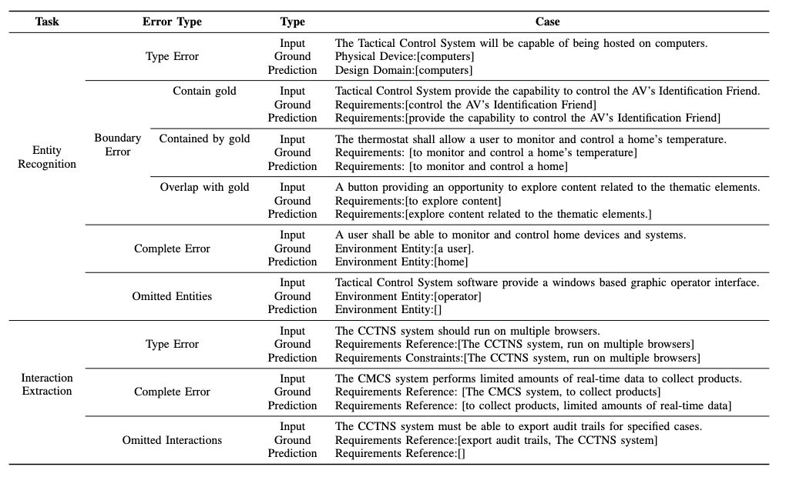

## Table of Contents

- Requirements
- Datasets
- Prompt
- Error Type and Examples
- Usage

## Requirements
* python=3.10
* vllm=0.7.2
* openai=1.63.2
* modelscope=1.23.0
* numpy=1.26.4

## Dataset

The dataset can be access at [data directory in this project](https://github.com/jdm4pku/RMBench/tree/main/data/total) .

Here is an sample in this dataset. 

```
{
    "text": "A DigitalHome System shall have the capability to establish an individual home web server hosted on a home computer.",
    "entity": {
      "Software System": [
        "A DigitalHome System"
      ],
      "Physical Device": [
        "a home computer"
      ],
      "Environment Object": [],
      "External System": [
        "an individual home web server"
      ],
      "System Requirements": [],
      "Shared Phenomena": []
    },
    "interaction": {
      "interface": [
        [
          "A DigitalHome System",
          "an individual home web server"
        ],
        [
          "a home computer",
          "an individual home web server"
        ]
      ],
      "requirements reference": [],
      "requirements constraints": []
    }
 }
```

## Prompt
The prompts for LLM-based solution can be accessed at [prompt directory in this project](https://github.com/jdm4pku/RMBench/tree/main/prompt). 
* An example of the prompt for entity recognition.

* An example of the prompt for interaction extraction.


## Error Type and Examples
Here are these error types and their examples.



## Usage

### Setup

* git clone https://github.com/jdm4pku/RMBench.git
* conda create -n RMBech python=3.10
* conda activate RMBench
* pip install vllm, pip install openai

### Evaluation
* bash ./script/run_ml.sh
* bash ./script/run_bert_crf.sh
* bash ./script/run_bert_softmax.sh
* bash ./script/run_deepseek.sh
* bash ./script/run_gemma2.sh
* bash ./script/run_gpt.sh
* bash ./script/run_llama3.sh
* bash ./script/run_qwen2.5.sh

